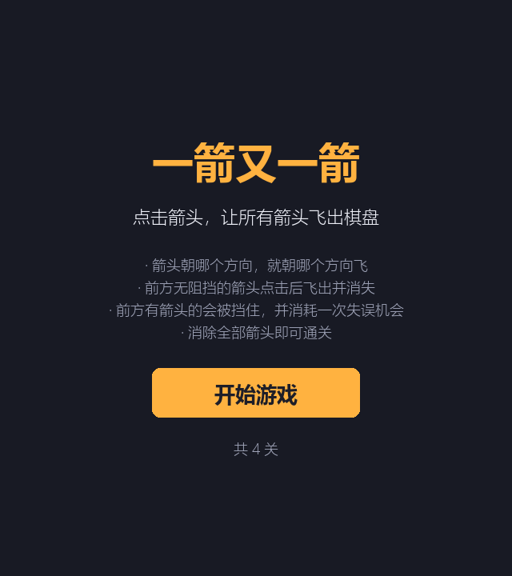
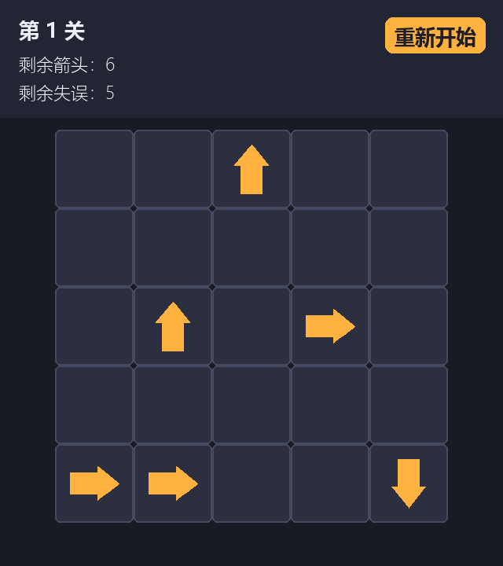
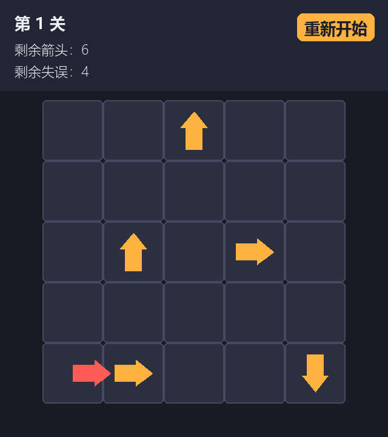
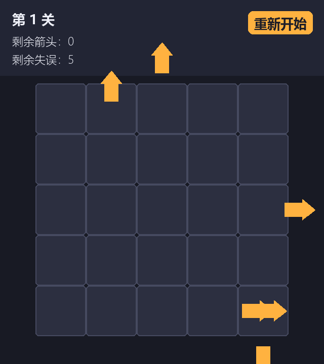

# 一箭又一箭（Arrow Puzzle）

一个使用 Python + Pygame 开发的点击式箭头解谜小游戏，参考微信小游戏《一箭又一箭》的核心玩法实现。

## 游戏简介

棋盘中有若干带方向的箭头（上 / 下 / 左 / 右）。玩家点击箭头后，程序会检查该箭头前进方向到棋盘边界之间是否存在其他箭头：

- **前方无阻挡**：箭头飞出棋盘并消失；
- **前方有阻挡**：箭头被挡住，无法消除，并播放「前顶弹回 + 变红」的碰撞反馈，同时消耗一次失误机会；
- 消除当前关卡的全部箭头即可进入下一关；
- 失误次数耗尽则本关失败，可以重新开始。

## 开发环境

| 项目 | 版本 |
| --- | --- |
| Python | 3.14（3.10+ 均可） |
| Pygame | pygame-ce 2.5.8（`import pygame` 与官方 pygame 用法一致） |
| 操作系统 | Windows 10 |

## 安装和运行方法

1. 安装依赖：

   ```bash
   pip install -r requirements.txt
   ```

   > 若 `pip install pygame` 在较新的 Python（如 3.14）下缺少预编译 wheel 而失败，
   > 请改用 `pip install pygame-ce`（本项目即使用 pygame-ce，导入名同样为 `pygame`）。

2. 运行游戏：

   ```bash
   python main.py
   ```

3. 运行自动化测试：

   ```bash
   python -m unittest test_game -v
   ```

## 游戏操作说明

- 鼠标**点击**棋盘中的箭头即可尝试让其飞出；
- 点击**前方无阻挡**的箭头：箭头飞出并消失；
- 点击**前方被阻挡**的箭头：箭头晃动变红，失误次数减 1；
- 顶部信息条显示：当前关卡、剩余箭头数量、剩余失误次数；
- 右上角**「重新开始」**按钮：把当前关卡恢复到初始状态；
- 通关 / 失败后，可通过按钮**下一关**、**重新开始**或**返回菜单**。

## 游戏截图

**开始界面**



**游戏界面**



**碰撞反馈**



**通关界面**



## 项目结构

```
arrow-game/
├── main.py          # pygame 图形界面入口（界面 / 动画 / 状态机）
├── core.py          # 纯逻辑：棋盘、方向、路径检测、自动求解
├── game.py          # 会话层：关卡推进、失误次数、点击判定
├── levels.py        # 关卡数据（共 4 关，均已校验可通关）
├── test_game.py     # 自动化测试（T01 ~ T06 + 关卡可通关校验）
├── requirements.txt # 依赖清单
└── screenshots/     # 游戏截图
```

## 核心实现说明

- **棋盘表示**：二维字符网格，`U / D / L / R` 表示四种方向箭头，`.` 表示空格。
- **路径检测**：从箭头所在格出发，沿其方向逐格前进；若在到达边界前遇到任何箭头即为「被阻挡」，否则「可飞出」。
- **可通关判定**：消除一个箭头只会减少障碍、不会新增障碍，因此「当前可飞出的箭头集合」随消除单调递增；贪心地反复消除任意可飞出箭头，即可判断关卡是否存在合理通关顺序（`core.Board.solve()`）。
